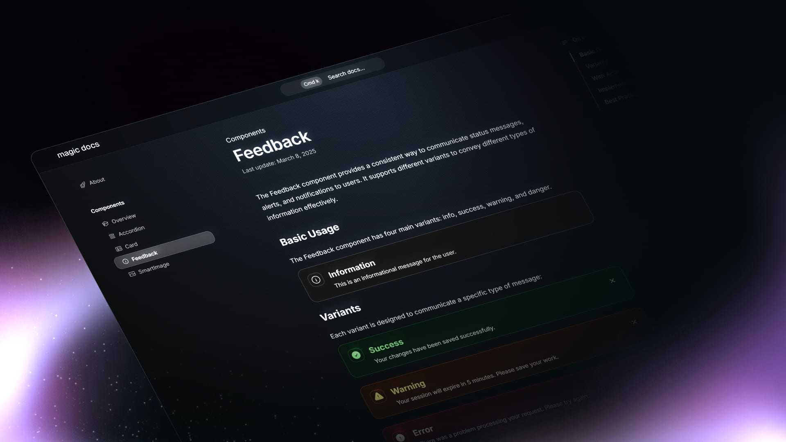

# **Build your documentation site with Once UI's Magic Docs**

View the [demo here](https://docs.once-ui.com).



# Getting started

Magic Docs was built with [Once UI](https://once-ui.com) for [Next.js](https://nextjs.org). It requires Node.js v18.17+.

**1. Clone the repository**
```
git clone https://github.com/once-ui-system/magic-docs.git
```

**2. Install dependencies**
```
npm install
```

**3. Run dev server**
```
npm run dev
```

**4. Edit config**
```
src/resources/once-ui.config.js
```

**5. Edit content**
```
src/content/
```

**6. Create documentation pages**
```
Add new .mdx files to src/content/
```

# Features

## Once UI
- All tokens, components & features of [Once UI](https://once-ui.com)

## SEO
- Automatic open-graph and X image generation with next/og
- Automatic schema and metadata generation based on the content file

## Design
- Responsive layout optimized for all screen sizes
- Timeless design without heavy animations and motion
- Endless customization options through [data attributes](https://once-ui.com/docs/theming)
- Light and dark mode support with system preference detection

## Documentation Features
- Organized documentation structure with nested categories
- Interactive code examples with syntax highlighting
- Searchable content with command palette (Cmd+K / Ctrl+K)
- Responsive navigation with mobile-friendly sidebar
- Supports all Once UI components

## Creators

Connect with us!

**Lorant One**: [Site](https://lorant.one) / [Threads](https://www.threads.net/@lorant.one) / [LinkedIn](https://www.linkedin.com/in/lorant-one/)

## Become a Oncer


Join the [Design Engineers Club](https://discord.com/invite/5EyAQ4eNdS) on Discord to connect with us and share your projects.

# License

TL;DR: Access to Magic Docs under Once UI Pro allows personal/internal use and modifications, but prohibits SaaS, resale, redistribution, and public sharing.

See `LICENSE.txt` for more information.